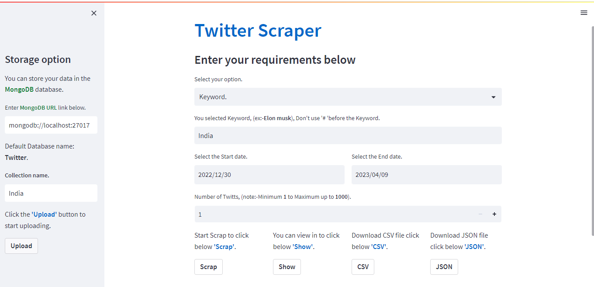

# Twitter Scraper
Twitter is one of the most popular social media platforms in the world, with millions of users sending out tweets, retweets, and replies every day. Twitter can be a goldmine of information, insights, and trends, but extracting that information can be a daunting task. This is where a Twitter scraper can be a valuable tool.
This tool simplifies the process of scraping Twitter data by the use of snscraper library. StreamlitPython library tool is used for providing more facilities you can view the data also you can download useful file formats like csv, json also you can able to store your data in your MongoDB server.

Disclaimer:- Education purpose only. 

# Required tools and library

**Initially you install some Python inbuilt libraries and Tools**.

## libraries

* pandas
* Numpy
* datetime
* date
* time
* timedelta
* streamlit
* snscrape
* snscrape.modules.twitter
* pymongo

### pandas

* Pandas is a Python library that provides powerful tools for data analysis and manipulation. It is built on top of the NumPy library and provides a high-level interface for working with data in a variety of formats, including CSV, Excel, SQL databases, and JSON.

* Pandas also provides powerful tools for data cleaning and manipulation. It includes functions for handling missing data, removing duplicates, and transforming data. Additionally, Pandas provides a wide range of statistical functions for analyzing data, including mean, median, and standard deviation.

### Numpy

* NumPy is a Python library for numerical computing that provides a powerful array data structure and a wide range of mathematical functions. It is widely used in scientific computing, data analysis, and machine learning.

### datetime

* Datetime is a Python module that provides tools for working with dates and times. It allows you to create, manipulate, and format dates and times in a variety of ways
 
### streamlit

* Streamlit is a Python library that allows you to create interactive web applications for data science and machine learning projects. It provides a simple and intuitive interface for creating web apps without requiring extensive knowledge of web development.

* With Streamlit, you can create web apps by writing simple Python scripts that generate visualizations, charts, and other interactive components. Streamlit automatically converts your Python code into a web app that can be accessed from a browser.

### snscrape

* Snscrape is a Python package for scraping social media platforms such as Twitter, Instagram, and Reddit. It allows you to extract large amounts of data from social media platforms, including tweets, Instagram posts, and Reddit threads.

* With Snscrape, you can search for social media posts based on various criteria, such as hashtags, keywords, usernames, and location. You can also specify the number of results to scrape and the date range to scrape.

### pymongo

* PyMongo is a Python library that allows you to interact with MongoDB, a popular NoSQL document database. It provides a simple and intuitive interface for connecting to MongoDB, querying data, and performing various database operations.

* With PyMongo, you can connect to a MongoDB database by specifying the host, port, and database name. Once connected, you can perform various operations on the database, such as inserting, updating, and deleting documents.

## Tools

* Visual Studio Code.
* Python 3.11.0 or higher.
* MongoDB software.

### Visual Studio Code

* Visual Studio Code (VS Code) is a free, open-source code editor developed by Microsoft. It has become one of the most popular code editors among developers due to its simplicity, flexibility, and powerful features.

### MongoDB

* MongoDB is a popular NoSQL document-oriented database that provides a flexible and scalable solution for storing and retrieving data. It uses a JSON-like format to store data in collections rather than tables as in traditional relational databases.

### python

* Python is a popular programming language that is known for its simplicity and ease of use. It was created by Guido van Rossum in the late 1980s and has since become one of the most widely used programming languages in the world. it is used for various applications like Web Development, Data Analysis, Machine Learning, Automation, Scientific Computing, Game Development.

# Features 

### Filters

* The application has filters you can able to filter your requirements like Keyword\Hashtag, Start date to End date, Number of data you scrape.

### View Results

* The application has a view option. when you click the **Show** button  You can view the scraped data in a data frame format

### Download Data

* The application has a download option.
you can able to download the data in a **csv**  or **json** format

### Save to MongoDB
* The application provides the option to store the data in the MongoDB server with the help of Pymongo library

# GUI

# User guide

1) Open the application in your browser.
2) Select the type of search - **Keyword\Hastag**
3) Type your Keyword\Hastag **Name**
4) Select **Startdate** and **Enddate**
5) Enter the **Number of tweets** to scrape
6) click **Scrap** button to start scrap
7) If you want to see your data click **Show**  after a few minutes to scrap
8) If you want to **Download** click **CSV** for CSV format or click **JSON** for JSON format
9) if you want to store your data in the MongoDB server click **UPLOAD**
**Follow the steps to scrap the data with the help of the application**

# Error during develop

* I am faced some problem during devolopement. When I was start the application in my web broser the application automatically scrap the data fron twitter .

### Solution
* I use Session statt from State management (docs.streamlit.io/library/apireference/session-state#session-state)

* In Streamlit, session state refers to the ability to store and retrieve user data across multiple sessions of a Streamlit app. Session state allows users to save data and settings, and have them persist across sessions of the app.

* Streamlit's session state functionality is implemented using the SessionState class, which allows you to store and retrieve user data. This class provides a simple and intuitive interface for creating and managing session state variables.

* When a Streamlit app is run, a new session is created for each user. The session state variables are initialized with their default values, and can be updated by the user during the session. When the user exits the app, the session state variables are saved and can be retrieved the next time the app is run.

* Session state variables can be of any data type, such as strings, integers, lists, and dictionaries. You can also use session state variables to store more complex data structures, such as pandas DataFrames or machine learning models.

* One of the benefits of using session state in Streamlit is that it allows you to create more personalized and customized user experiences. For example, you can allow users to save their preferences and settings, and have them applied automatically the next time they use the app.

* Overall, session state in Streamlit is a powerful feature that allows you to create more interactive and personalized apps. It provides a simple and intuitive interface for storing and retrieving user data across multiple sessions of a Streamlit app.

# Video link 

* https://www.linkedin.com/posts/gopinath-b-56a02b169_twitterscraping-scraping-twitter-activity-7051088597927530496-ftLP?utm_source=share&utm_medium=member_desktop

